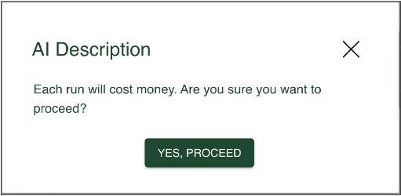
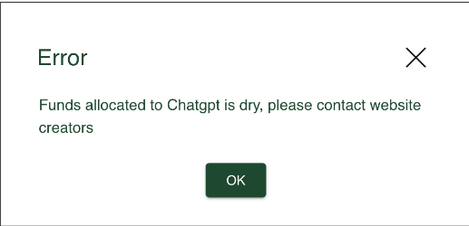

# Project Summary 
Currently, computer science events and call-for-papers are scattered across multiple sources such as WikiCFP and EasyChair, making it difficult to track and manage. EventHubb aims to solve this problem by utilising web scrapers to aggregate event information into a central location through a user-friendly website. EventHubb crawls data from other websites, including WikiCFP and EasyChair. While these websites are difficult to navigate and don’t cater to users’ preferences, EventHubb aims to elevate the user experience by providing customisation, notifications and AI-generated summaries, all behind a visually appealing website.

Key features include user authentication, profile management, event aggregation, search and browsing, a customisable calendar and admin event management. The end goal of EventHubb is for all users to be able to browse efficiently for computer science and call-for-papers events and register for those that interest them. From then, EventHubb will provide users with frequent reminders and notifications to ensure they can always stay on top of their deadlines. 

# Installing EventHubb
## Docker
As our project uses Docker to simplify the installation process, it must be installed before proceeding according to their installation instructions.
## Secrets
Before we can run the docker and install our app, we must first set up the environment variables required to run it. Assuming you have access to the codebase already by cloning the repository, simply navigate to the root directory of the project, then create a plain text file named .env and copy the following values in the file:

```
# see installation manual for secrets
```

Then navigate to the frontend directory within the project and copy the following value into the file:

```
# see installation manual for secrets
```


## Installation
Ensure that the Docker app is open, then run the command “docker-compose up” in the root directory of the project and you will be able to access the url http://127.0.0.1:5173 on your browser.

# Things to note
## AI summary
The AI button can only be run on the admin page, and each run will prompt the below popup as it costs money. 



When the ChatGPT funds have run out, it will prompt the message below, indicating that the function will no longer work.

